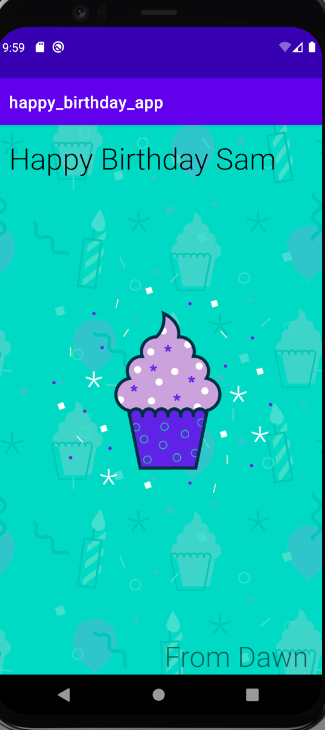

# gdg_kotlin_course
[GDG android course](https://developer.android.com/courses/android-basics-kotlin/unit-1)

## Unit 1: Kotlin Basics

### Build a basic layout 



### Add a button

#### Classes and Objects

##### Dice Excercise

```
fun main() {
  val myFirstDice = Dice()
  val diceRoll = myFirstDice.roll()
  println("Your ${myFirstDice.sides} sided dice rolled a ${diceRoll}!")
   }
    class Dice{
       var sides = 6

        fun roll() : Int {
            val randomNumber = (1..6).random()
            return(randomNumber)
        }
}
```
```
fun main() {
	val myFirstDice = Dice(6)
	println("Your ${myFirstDice.numSides} sided dice rolled ${myFirstDice.roll()}!")

  val mySecondDice = Dice(20)
    println("Your ${mySecondDice.numSides} sided dice rolled ${mySecondDice.roll()}!")

   }
    class Dice(val numSides: Int){

        fun roll() : Int {
          return(1..numSides).random()
        }
}

```
- Call the `random()` function on an `IntRange` to generate a random number: (1..6).random()
- Classes are like a blueprint of an object. They can have properties and behaviors, implemented as variables and functions.
- An instance of a class represents an object, often a physical object, such as a dice. You can call the actions on the object and change its attributes.
- You can supply values to a class when you create an instance. For example: `class Dice(val numSides: Int)` and then create an instance with `Dice(6)`.
- Functions can return something. Specify the data type to be returned in the function definition, and use a return statement in the function body to return something. For example: `fun example(): Int { return 5 }`


#### Dice Roller App


#### Tip Calculator App

 
